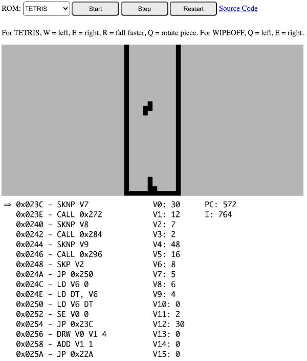

# Yet Another Chip-8 Emulator

A [Chip-8](https://en.wikipedia.org/wiki/CHIP-8) emulator written in JavaScript. Just for fun!

# ScreenShot
Here is a screenshot:

# Other Emulators
Rust: https://github.com/ColinEberhardt/wasm-rust-chip8

Javascript: https://github.com/taniarascia/chip8

Golang: https://github.com/massung/CHIP-8

# Licence
This code is free for you to use under the MIT licence.
